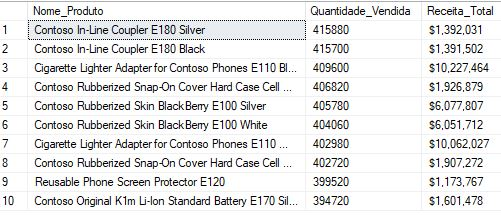

fazendo novo teste

# Top 10 Produtos Mais Vendidos - Contoso

## 🧠 Objetivo
Identificar os 10 produtos com maior volume de vendas no banco de dados Contoso, utilizando SQL Server.

## 🔧 Ferramentas e Técnicas
- SQL Server
- SSMS (SQL Server Management Studio)
- Comandos SQL: `SELECT`, `JOIN`, `GROUP BY`, `ORDER BY`, `TOP`

## 📊 Resultado

